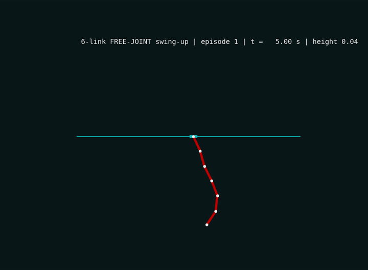

# pendulum6f — FREE-JOINT 6-Link Swing-Up + Balance

The sequel to the elastic-joint solve: **no springs**. Six free-jointed
uniform rods (1 m, 0.2 kg each) on a cart, ±120 N at 200 Hz. The policy must
swing the chain up from fully hanging and balance it for as long as physics
allows.



*(full video: [artifacts/pendulum6f_swingup.mp4](artifacts/pendulum6f_swingup.mp4))*

## Result (100 eval episodes, deterministic policy, fully-hanging starts)

| Metric | Value |
|---|---|
| Swing-up reached the top | **100/100** |
| Best hold per episode | median **0.44 s**, p90 0.52 s, max 0.60 s |
| Total balanced time per 30 s episode | median **2.07 s** (repeated catches) |

Verified on the training pod and reproduced on a second machine.

## The two findings that matter

**1. Static balance of a free 6-link chain is provably impossible** under any
practical force/precision budget. LQR analysis (`lqr_study.py`): required
feedback gains ~10⁵; the saturated linear stabilization basin is ~2·10⁻⁴ rad.
We swept rod vs point-mass inertia, joint damping (makes it *worse* —
friction fights cart authority through the chain), tip masses (much worse —
a loaded chain buckles like a column), and geometry. The only mild lever is
link length. Long-link configs (1 m) show rare saturated-LQR runs that lock
in for 60 s+, proving a stabilizing orbit exists — but it is not reachable as
a *static* regulation problem.

**2. Achieved hold times follow a ~9 e-fold law.** Across three geometries,
trained holds plateau at ≈9 e-folds of the chain's fastest unstable mode
(λ=21/s → 0.4 s; λ=16.8/s → 0.5 s). This is a policy precision floor, not a
training artifact: holds end when the un-regulatable residual error grows
from the policy's noise floor past the fall threshold. Multi-second static
holds of a free 6-link chain would require either far slower physics or
super-human actuation precision. What IS achievable — and what this policy
does — is perpetual dynamic recovery: whip up, hold ~half a second, catch the
fall, whip again.

## How it was trained (no hyperparameter search)

One PPO configuration end to end (PufferLib defaults + entropy annealing).
The work is done by a **self-paced reverse curriculum** built into the env
(`pendulum6f.h`): each of 4096 envs tracks its own progress p ∈ [0,1] and
starts episodes tilted up to p·180° from vertical — near-upright at p=0,
fully hanging at p=1. Success (a 75-step hold) advances p; failure decays it
slightly. The curriculum keeps every env at its edge of competence, where
gradients are dense and hyperparameters barely matter.

Total compute: a single RTX A6000 for ~4 hours (~$2), vs the brute-force
alternative of thousands of hyperparameter-sweep runs. Curriculum progression
0→1 happened in one run (~1.5B steps), with two interventions guided by live
metrics: softening the success gate (150→75 steps) when progress stalled at
p≈0.43, and reducing curriculum back-off.

Training details: dt=5 ms (200 Hz control), 3-substep semi-implicit Euler on
analytic rod-chain Lagrangian dynamics (energy conserved to 0.1%, horizontal
momentum to 1e-3 — both invariants verified in `test_physics.c`), randomized
episode lengths (8–20 s) to prevent termination gaming, MinGRU policy
(512×2, ~1.6 M params), fp32 forward pass (`./build.sh pendulum6f --float`).

## Reproduce the eval (CPU only)

```bash
cd ocean/pendulum6f
gcc -O2 -shared -fPIC -o libpendulum6f.so p6f_shim.c -lm
python3 eval_policy.py ../../artifacts/checkpoint_peak_1.57B.bin \
    --episodes 100 --align 4
```

`--align 4` matters: fp32 builds align tensors to 16 bytes = 4 floats in the
parameter buffer (bf16 builds: 8 elements). See `eval_policy.py:load_flat`.

## Retrain

```bash
# inside a PufferLib clone with these files copied in (needs CUDA + clang)
./build.sh pendulum6f --float
python -m pufferlib.pufferl train pendulum6f \
    --train.anneal-ent-coef 1 --train.min-ent-coef-ratio 0.1
```

Note: select the checkpoint by eval, not the final one — late entropy
annealing degraded the last ~1B steps (peak was at 1.57B).
